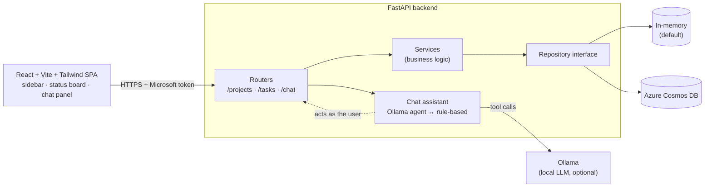

# Task Tracker

A full-stack **task & project tracker** built to demonstrate a clean, layered,
async architecture — a production-style **FastAPI** backend, a **React** SPA, and
a natural-language chat assistant powered by a local LLM.

[](https://github.com/nikredhil/fastapi-cosmos-api/actions/workflows/ci.yml)


> Runs out of the box with **no database, no cloud account, and no API keys** —
> it ships with an in-memory backend and a rule-based assistant, so you can clone
> and explore in under a minute. Flip one env var for **Azure Cosmos DB**, and run
> [Ollama](https://ollama.com) to upgrade the assistant to a local LLM.

## Overview



The **repository interface** is the seam that lets the same service code run
against either storage backend. The **chat assistant** runs server-side: the LLM
is given tools and the backend executes them against its own API as the
signed-in user — so all auth and per-user isolation are enforced by the normal
routes, and it cleanly falls back to a deterministic engine when no LLM is
present.

## Highlights

- **FastAPI + Uvicorn**, fully async (`async`/`await` end to end)
- **Pluggable storage** behind a repository interface: in-memory (default) or **Azure Cosmos DB**
- **Sign in with Microsoft** (Entra ID / OIDC): the SPA authenticates via MSAL (Auth Code + PKCE); the API validates the ID token against Microsoft's public keys (RS256/JWKS), with per-user data isolation
- **Layered design**: routers → services (business logic) → repositories → backend
- **Pydantic v2** request/response models with validation and OpenAPI docs
- **Structured logging** via `structlog`
- **React + Vite + Tailwind** SPA: project sidebar, status board, and a chat panel
- **Chat assistant** served at `POST /chat` — a **local-LLM tool-calling agent** via [Ollama](https://ollama.com), with a deterministic **rule-based fallback** so it runs with no LLM at all (no API key, no cloud)
- **Tests** with `pytest` + `httpx` against the ASGI app (no network needed)
- **Dockerfile** for containerized deployment

## Architecture

```
app/
├── main.py                       # App factory, lifespan wiring, middleware
├── core/
│   ├── config.py                 # Settings from env / .env
│   ├── security.py               # Microsoft (Entra ID) token validation (JWKS/RS256)
│   ├── logging.py                # structlog setup
│   └── dependencies.py           # FastAPI dependency providers
├── db/
│   ├── cosmos_client.py          # Async Cosmos connection + repository
│   └── repositories/
│       ├── base.py               # Abstract repository interface
│       ├── memory.py             # In-memory backend (default)
│       ├── project_repository.py # Project data access
│       └── task_repository.py    # Task data access
├── models/
│   ├── domain/enums.py           # Status / priority enums
│   └── schemas/                  # Pydantic request/response models
├── services/                     # Business logic (project + task)
├── chat/
│   ├── chat_engine.py            # Rule-based natural-language assistant (fallback)
│   ├── llm_agent.py              # Ollama tool-calling agent (list/create projects & tasks)
│   ├── assistant.py              # Backend selector (Ollama ↔ rules) with graceful fallback
│   └── api_client.py             # HTTP client the assistant uses to act as the user
└── api/routers/                  # HTTP routers (health, projects, tasks, chat)

frontend/                         # React + Vite + Tailwind single-page app
├── src/api.js                    # Fetch client for the API
├── src/App.jsx                   # Sidebar + board + chat layout
└── src/components/               # Login, Board, TaskCard, ChatPanel

scripts/
└── seed_data.py                  # Populate sample projects/tasks via the API
```

The repository interface (`db/repositories/base.py`) is the seam that lets the
same service code run against either backend — the in-memory store for local
work and tests, Cosmos DB in production.

## Quickstart

```bash
python -m venv .venv
source .venv/bin/activate        # Windows: .venv\Scripts\activate
pip install -r requirements.txt

uvicorn app.main:app --reload --port 8000
```

Open the interactive docs:

- Swagger UI: http://localhost:8000/docs
- ReDoc: http://localhost:8000/redoc

### Authentication setup (Sign in with Microsoft)

The API is protected by Microsoft Entra ID. Register a free app once:

1. **Azure portal → Entra ID → App registrations → New registration.**
2. **Supported account types:** *Accounts in any organizational directory and personal Microsoft accounts.*
3. **Platform:** *Single-page application*, Redirect URI `http://localhost:5173`
   (add your production origin later). No client secret is needed (public client + PKCE).
4. Copy the **Application (client) ID** into the API's `.env` as `AZURE_CLIENT_ID`.

The SPA fetches this config from `GET /auth/config`, so the client id lives only
in the API environment. To allow just one tenant, set
`AZURE_AUTHORITY=https://login.microsoftonline.com/<tenant-id>`.

### Try the API with a token

Protected routes need a Microsoft ID token. Sign in via the web app, then copy
the `Authorization: Bearer …` value from a `/projects` request in the browser's
DevTools → Network tab:

```bash
TOKEN="<paste the ID token>"

# Create a project
PID=$(curl -s -X POST localhost:8000/projects \
  -H "Authorization: Bearer $TOKEN" -H 'Content-Type: application/json' \
  -d '{"name":"Website redesign"}' | python -c "import sys,json;print(json.load(sys.stdin)['id'])")

# List tasks
curl -s localhost:8000/projects/$PID/tasks -H "Authorization: Bearer $TOKEN"
```

## Sample data

With the server running, populate some realistic projects and tasks:

```bash
API_TOKEN="<your Microsoft ID token>" python scripts/seed_data.py
API_BASE=http://localhost:8055 API_TOKEN="<token>" python scripts/seed_data.py
```

> The default in-memory backend is per-process, so re-seed after restarting the
> server. With `DB_BACKEND=cosmos` the data persists.

## Web UI (React)

A **React + Vite + Tailwind** single-page app provides a project sidebar, a
status board (To Do / In Progress / Blocked / Done), and a chat panel.

```bash
# 1. Start the API
uvicorn app.main:app --port 8000

# 2. Start the frontend (in another terminal)
cd frontend
npm install
npm run dev            # http://localhost:5173
```

Point the UI at a non-default API by setting `VITE_API_BASE` (see
`frontend/.env.example`). Click **Sign in with Microsoft**, complete the popup,
then manage tasks on the board or talk to the assistant. (Requires
`AZURE_CLIENT_ID` on the API — see *Authentication setup* above.)

## Chat assistant: local LLM + fallback

The assistant runs **server-side** at `POST /chat` (authenticated). The chat
panel calls it; you can also `curl` it directly. It has two backends, selected
by `CHAT_BACKEND` (default `auto`):

| Backend  | What it does                                                                 |
| -------- | ---------------------------------------------------------------------------- |
| `ollama` | A **tool-calling agent** on a local [Ollama](https://ollama.com) model. The LLM is given tools (list/create projects & tasks, find by status), decides which to call, and the server executes them against the API as the signed-in user. |
| `rules`  | A **deterministic** intent parser. Zero dependencies — used as the automatic fallback when Ollama isn't reachable or errors. |

`auto` uses Ollama if it's running, otherwise rules — so the project works with
or without an LLM, and **never requires an API key or cloud service**. Each
reply is tagged in the UI with the backend that produced it (`via ollama` /
`via rules`). Examples: *what's blocked?*, *summary*, *create project Website*,
*add a task called Draft homepage to Website with high priority*.

To enable the LLM agent:

```bash
# Install Ollama (https://ollama.com), then pull a tool-capable model:
ollama pull llama3.2

export CHAT_BACKEND=auto         # or "ollama" to require it
export OLLAMA_MODEL=llama3.2     # any tool-capable model
uvicorn app.main:app --port 8000
```

## Configuration

Copy `.env.example` to `.env` and adjust. Key settings:

| Variable        | Default            | Description                                   |
| --------------- | ------------------ | --------------------------------------------- |
| `DB_BACKEND`    | `memory`           | `memory` (zero setup), `file` (durable JSON), or `cosmos` |
| `COSMOS_ENDPOINT` / `COSMOS_KEY` | —     | Required when `DB_BACKEND=cosmos`             |
| `COSMOS_DATABASE` | `tasktracker`    | Cosmos database name (created if absent)       |
| `AZURE_CLIENT_ID` | —                | Entra ID app (client) ID — **required** for sign-in |
| `AZURE_AUTHORITY` | `…/common`       | Allowed accounts; use `…/<tenant-id>` for single-tenant |

### Using Azure Cosmos DB

```bash
export DB_BACKEND=cosmos
export COSMOS_ENDPOINT="https://<account>.documents.azure.com:443/"
export COSMOS_KEY="<primary-key>"
uvicorn app.main:app
```

Containers (`projects`, `tasks`) and the database are created automatically on
startup if they don't exist.

## Tests

```bash
pytest -v
```

## Docker

```bash
docker build -t task-tracker-api .
docker run -p 8000:8000 task-tracker-api
```

## License

MIT — this is a personal portfolio project.
